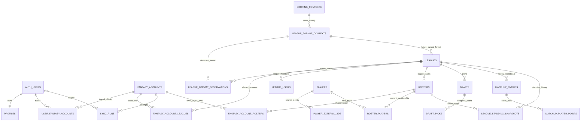

# Fantasy data architecture

This contract defines the durable data boundaries for FANTASY HUD. It governs future provider imports and analytics without creating those future tables prematurely. Migrations remain the SQL source of truth; this document defines grains, relationships, and history rules.

## Core rules

1. Store one provider resource once and associate tracked fantasy accounts with it explicitly.
2. Represent app-user authorization only through `user_fantasy_accounts`; shared provider rows never carry app-user ownership.
3. Keep provider IDs as exact text. Never parse them as JavaScript numbers.
4. Preserve exact source settings separately from derived filter dimensions.
5. Keep mutable current state separate from append-only or completed historical facts.
6. Derive analytics from source facts and associations. Do not persist universal ownership, stack, value, or user-pick flags.
7. Scope every portfolio query through at least one tracked fantasy account.
8. Add tables at a documented grain, not through a generic entity, object, document, or record store.
9. Keep league discovery provider-consistent: `fantasy_accounts.provider`, `leagues.provider`, and `sync_runs.provider` must match.
10. Mutate provider data only through reviewed, narrowly scoped service-only RPCs; service credentials receive no direct provider-table CRUD.
11. Protect complete mutable collections with a collection-level watermark; per-row freshness alone cannot represent a newer observation of absence.
12. Treat exact provider scoring settings as authoritative immutable scoring identity; derived labels are filters and diagnostics, not replacements.
13. Keep scoring context, league format context, and the future draft environment as separate versioned layers.
14. Treat ADP and average pick as contextual query results, never mutable player or pick properties.
15. Never silently broaden a context match, count one canonical provider draft more than once, or use future information in an at-time comparator.
16. Derive positional ADP rank from context-specific player ADP inside a versioned draft-time position group; never require or persist a provider-supplied label such as `RB17`.
17. Treat season rank as a typed, scoring-context-specific, through-period result. Total-points and points-per-game rankings remain distinct, and no universal current rank belongs on `players`.
18. Keep raw football statistics, exact-context fantasy scoring results, and player rankings at separate grains. Reuse one scoring result across every league sharing the same scoring context instead of duplicating raw stats per league.
19. Do not assume Sleeper's consumer surfaces or documented public API provide a supported player-statistics, projection, ranking, or ADP feed; source authorization, licensing, coverage, revision, and category feasibility are a separate implementation gate.
20. Preserve position and NFL team at draft on historical draft facts, and resolve outcome position through a versioned period-specific methodology. Never silently join historical performance only to the current player profile.
21. Keep player-level positional-rank delta as a display measure, not an additive cross-position unit. Portfolio and team aggregation use a versioned comparable scale such as capital percentile, outcome percentile, or points above expectation.
22. Derive performance-versus-capital analytics from immutable picks, exact draft environments, prior-only eligible comparator samples, context-scored outcomes, and versioned ranking and expected-outcome methods; never store mutable hit, bust, alpha, or outperformance flags on source rows.
23. Make aggregation paths explicit at pick, player, NFL team at draft, draft or fantasy roster, league, and tracked-portfolio grains. Deduplicate network drafts canonically while attributing portfolio picks only through explicit tracked-account draft associations.
24. Preserve every material scoring difference in semantic compatibility. Normalize only reviewed semantic no-ops; unknown or malformed values remain in bounded exact fallback and narrow matching.
25. Make exact league settings part of immutable exact format identity, and recompute every identity and derived routing field before insertion.
26. Keep exact lineup order separate from compatible lineup composition. Compatibility uses every exact slot token and count, while quarterback topology and IDP remain independent dimensions.
27. Treat provider-neutral compatibility keys as versioned FANTASY HUD semantic identities, not proof that an unmapped source provider is equivalent.
28. Permit one accepted format context per league and source observation time. Exact replay is idempotent; a contradiction fails closed and rolls back the enclosing discovery mutation.

## Layered model



Relationships through `SYNC_RUNS` are implemented by Task 005. Task 007A implements player identity, Task 007B.1 implements league users, rosters, tracked-account roster ownership, and current roster membership, and Task 007B.2 populates that roster domain. Task 008A.1 introduces scoring-context, league-format-context, and format-observation relationships on the current undeployed draft branch and documents the future context-aware ADP and performance-versus-draft-capital contract. Draft, statistics, scoring-result, ranking, performance, matchup, standing, and transaction relationships remain planned; their presence in this contract does not assert that their tables or foreign keys exist.

## Layer 1 — Identity

Implemented before Task 005:

### `profiles`

Grain: one application profile per `auth.users` row.

This is app presentation state, not provider identity.

### `fantasy_accounts`

Grain: one shared provider identity per `(provider, external_user_id)`.

Usernames and display fields are mutable. The provider user ID is the canonical identity. `last_synced_at` remains reserved for a complete portfolio synchronization, not identity resolution or league discovery.

### `user_fantasy_accounts`

Grain: one app user's tracked association to one shared fantasy account.

This association is the root of portfolio authorization. It does not prove ownership of the external provider identity.

## Layer 2 — Shared provider dimensions

### `provider_season_states` — implemented in Task 005

Grain: the latest fetched state for one `(provider, sport)` pair.

It carries current provider season, league season, creation season, previous season, period fields, season start date, exact provider metadata, and fetch time. It is mutable current state and is not a historical week table.

### `leagues` — implemented in Task 005

Grain: one shared provider league per `(provider, external_league_id)`.

The row contains exact provider settings plus independent derived dimensions:

- `roster_management_type`: `redraft`, `keeper`, `dynasty`, or `unknown`
- `is_best_ball`
- `has_superflex`
- `has_idp`
- `scoring_format`: `ppr`, `half_ppr`, `standard`, `custom`, or `unknown`

A league may be dynasty and best ball simultaneously. Broad scoring never replaces exact `scoring_settings`. One league may have multiple drafts, so no draft foreign key belongs on the league row.

`roster_bundle_fetched_at` is the nullable observation time of the latest fully validated users-and-rosters bundle published for the shared league. It is distinct from league-discovery `fetched_at`. A common per-league watermark is correct because publication requires both source endpoints to succeed and the complete bundle to validate.

### Scoring and league format contexts — Task 008A.1 draft branch

#### `scoring_contexts`

Grain: one immutable exact scoring identity per provider, sport, normalization version, and scoring fingerprint.

The exact source `scoring_settings` JSON is authoritative. A provider-specific canonical fingerprint and normalization version define immutable identity. A changed exact source object or classification version creates or reuses a different row; no context is updated in place.

Derived fields may include broad format (`ppr`, `half_ppr`, `standard`, `custom`, or `unknown`), reception points, passing-touchdown points, tight-end bonus, position-specific reception or bonus flags, IDP scoring state, a versioned compatibility key, and bounded diagnostics. Version 1 may classify base receptions of `1` as PPR, `0.5` as Half-PPR, and `0` as Standard; reviewed position-specific or premium rules that make the base misleading are Custom, while absent or malformed values are Unknown. Broad format and compatibility keys are never unique scoring identities.

The version-one effective-scoring projection preserves every supported point-changing rule, including passing, rushing, receiving, first-down, two-point, fumble, kicking, team-defense, special-teams, IDP, bonus, and position-specific scoring. It removes only explicitly allowlisted, reviewed additive-bonus rules whose value is numeric zero and numeric `rec_fb`, `rec_qb`, `rec_rb`, `rec_te`, or `rec_wr` values equal to numeric base `rec`. Unknown keys and malformed values remain through bounded exact fallback rather than disappearing. The compatibility key uses the provider-neutral `fantasyhud:nfl:scoring_compatibility` namespace; exact scoring identity remains provider-specific, and another provider is not considered equivalent until it has a reviewed semantic mapping.

#### `league_format_contexts`

Grain: one immutable exact league-level draft-relevant format per normalization version and format fingerprint.

The identity references one scoring context and includes its exact scoring fingerprint plus exact ordered roster positions, exact league-settings fingerprint, team count, roster size, roster-management type, best-ball state, quarterback topology, and IDP state. Exact league settings and roster positions remain stored on the row; their fingerprints participate in immutable identity, so a row with different exact settings cannot be reused.

`lineup_fingerprint` preserves exact roster-position order. The dedicated `lineup_profile` is an order-independent count object that preserves every exact slot token, including safe unknown tokens, and `lineup_profile_fingerprint` provides provider-neutral compatible identity. Equal counts in a different order may be compatible without being exact; different WR, TE, FLEX, bench, reserve, taxi, QB, IDP, or unknown-token counts remain distinct even when roster size is equal.

`quarterback_format` is independently derived as `one_qb`, `superflex`, `two_qb`, `two_qb_superflex`, `no_qb`, `custom`, or `unknown`; `has_idp` remains a separate boolean. The version-one draft-relevant league-settings projection covers reviewed `type`, `best_ball`, `num_teams`, `capacity_override`, `draft_rounds`, `max_keepers`, `pick_trading`, reserve-slot and reserve-eligibility settings, and taxi-slot, taxi-year, taxi-veteran, and taxi-deadline settings. Every other exact key/value enters a provider-neutral fallback fingerprint, narrowing matching until classified.

The format compatibility key combines semantic scoring compatibility, lineup-profile fingerprint, team count, roster size, roster-management type, best-ball state, quarterback format, IDP state, the reviewed settings projection, and conservative fallback. `context_quality` is `exact`, `partial`, or `unknown`. One version-one classifier supplies both creation and insert validation; immutable insertion recomputes scoring linkage, league-settings, ordered-lineup, lineup-profile and exact-format fingerprints, quarterback format, compatibility key, context quality, and derived dimensions. Unsupported providers or versions cannot claim exact quality. `leagues.current_format_context_id` points through this format context to scoring identity, so the league does not duplicate a mutable scoring-context pointer.

#### `league_format_observations`

Grain: one accepted league-format observation event for one league and source observation time, carrying one context, source, and normalization version.

Observations are append-only and unique by league plus observation time. Replaying the same context and version is idempotent. A different context or version at the same time fails closed and, because discovery and context maintenance share one transaction, rolls back the underlying league source fields, current pointer, and observation together. A later accepted representation may append history; an older representation is stale and appends nothing. History begins with the first known stored accepted observation and never fabricates an older context from current league state.

Task 008A.1's undeployed draft migration creates these tables, the league pointer, atomic league-discovery integration, immutable owner-only helpers, scoped RLS, and safe derived projections. Its semantic-integrity correction amends that same unmerged migration; no second migration is introduced. Its performance-versus-draft-capital work is documentation only: the task adds no statistics, scoring-result, ranking, or performance table or data. The context tables are not Production state until the correction is reviewed, merged, and hosted verification passes.

### `fantasy_account_leagues` — implemented in Task 005

Grain: one observation that provider user-league discovery reported one league for one tracked fantasy account.

`first_seen_at`, `last_seen_at`, and `removed_at` describe discovery history. `last_seen_at` cannot precede `first_seen_at`, and `removed_at` is null or at least `last_seen_at`; a removal cannot precede the last positive observation. Removing or marking one association does not delete the shared league. This row does not prove roster ownership.

League-discovery persistence must validate transactionally that the tracked fantasy account, discovered league, and sync run have the same provider. The association does not repeat the provider column.

Roster import records account/league ownership resolution on this association with paired nullable `roster_ownership_status` and `roster_ownership_observed_at`. The allowed evaluated states are `owned`, `not_owned`, and `unresolved`; null means ownership has never been evaluated. `owned` means exactly one current canonical roster matches the account, `not_owned` means complete current shared state confirms no match, and `unresolved` means current co-owner source state cannot distinguish absence from unknown. The observation time follows the league roster-bundle watermark.

### Roster dimensions — architecture in Task 007B.1, import in Task 007B.2

#### `league_users`

Grain: one provider user identity as represented within one league.

This supports display and commissioner/member context without duplicating global fantasy accounts.

#### `rosters`

Grain: one league-local provider roster.

Future Sleeper roster IDs are league-local integers and must be paired with the league key. Exact co-owner, player, starter, reserve, taxi, and keeper arrays remain nullable source facts beside normalized membership: null means absent or source-null, while an empty array means explicitly empty. Current holdings are mutable state; historical facts are recorded separately.

#### `fantasy_account_rosters`

Grain: one explicit association between a tracked fantasy account and a league roster.

This is the stored roster-ownership history path. It must not be inferred from league discovery alone. Current confirmed ownership additionally requires the matching `fantasy_account_leagues` resolution status to be `owned`; an active preserved row under `unresolved` remains historical state and is excluded from current ownership analytics.

### Player dimensions — implemented in Task 007A

#### `players`

Grain: one canonical football entity.

The entity may represent an offensive player, defensive player, team defense, or another explicitly modeled football entity. Current profile fields can include name, position, physical/bio data, NFL team, injury state, depth-chart state, free-agent state, and provider update timestamps. Team changes and other mutable profile fields update this current row while historical facts retain their original context.

#### `player_external_ids`

Grain: one provider or source external ID for one canonical player.

This mapping must support Sleeper IDs, ESPN IDs, Yahoo IDs, statistics-provider IDs, team-defense identities, free agents, and future source-specific timestamps. Its canonical key includes source plus exact text external ID; a player may have several source mappings.

#### `roster_players`

Grain: one current roster + canonical player membership.

This mutable current-membership table supports `roster_id`, `player_id`, `is_starter`, `is_reserve`, `is_taxi`, `is_keeper`, source and starter order, source status or roster-position metadata, `first_seen_at`, and `last_seen_at`. Active membership and starter orders are unique within each roster. Starter, reserve, taxi, keeper, and other source-grounded states remain current facts even when they do not change an exposure calculation.

Best-ball player exposure counts every current roster membership regardless of starter or bench labels. Drafted exposure comes from immutable `draft_picks`, weekly lineup history comes from `matchup_player_points`, and historical acquisitions, drops, and trades come from transaction facts. Current `roster_players.is_keeper` never substitutes for a future completed `draft_picks.is_keeper` fact. A membership-period or roster-snapshot table may be added only when source completeness or measured product requirements prove those facts insufficient.

Shared current league users, rosters, and memberships are readable only while the app user reaches their league through at least one active account-to-league discovery association. Removed discovery history does not authorize shared current rows. Account-scoped current and historical `fantasy_account_rosters` ownership remains readable through the tracked fantasy account independently of shared league reachability.

Task 007B.2 makes shared roster-domain state monotonic by the per-league fully validated bundle watermark. After locking the canonical league, an equal-or-newer bundle may apply every shared user, roster, membership, annotation, and removal change and advance `roster_bundle_fetched_at` atomically. An older bundle skips every shared mutation, including creation and reactivation, so stale inclusion cannot reverse newer absence. Per-row freshness guards remain defense in depth. Concurrent shared creation uses insert-or-load, never catch-and-ignore, and locking follows external league ID, league-user ID, roster ID, then exact player ID. Removal is scoped to the exact account/provider/sport/season/league collection and freshness-guarded for shared rows. Simultaneous same-resource, stale-absence, and ownership-state local-Supabase integration scenarios are required merge gates.

Only a roster's exact `players` array defines normalized current membership. Source-null players preserve prior membership while explicit empty confirms zero. Null starter, reserve, taxi, or keeper annotations preserve prior confirmed normalized state; explicit empty arrays clear it. The dashboard therefore renders a null source array as `Not reported` and an explicit empty array as `0`, never as the same state. Every normalized membership carries validated `annotation_source_state` values (`known` or `unknown`) for starters, reserve, taxi, and keepers plus bounded safe warning tokens. Product reads render each annotation as `Yes`, `No`, or `Not reported`; a preserved prior boolean remains last-confirmed internal state when the latest source is null. The exact verified `"0"` starter placeholder remains in the source array but never creates a canonical player. Valid unmapped non-placeholder holdings create sparse source-marked canonical identities so catalog lag cannot discard a current holding.

Roster source scope is frozen from current provider state and active account-to-league discovery at run start. The complete expected users-and-rosters collection validates before private staging, and public publication occurs only when the staged league set exactly equals the frozen set. Every raw league-user object must carry an exact source `league_id` equal to the requested league before normalization; the validated stage remains scoped by its canonical league rather than redundantly storing that ID on each normalized user. Provider avatar IDs are optional exact identifiers and reject padding or controls rather than receiving display-label trimming. Ambiguous co-owner absence yields a truthful partial run, records `unresolved`, and preserves prior account-specific ownership history without presenting it as current confirmed ownership.

## Layer 3 — Historical and period facts

These tables are planned, not created by Task 005.

### Drafts and pick ownership

#### `drafts`

Grain: one provider draft in its league or provider context.

A league may have zero, one, or many drafts. Draft status is mutable until the source completes the draft; source completion makes the board immutable except for reviewed correction workflows.

Task 008A.2 must give every draft `league_format_context_id`, `context_resolution_status`, `context_observed_at`, `draft_environment_fingerprint`, `draft_environment_version`, and `draft_pool_type`. Context resolution is `exact`, `partial`, or `unknown`. A current league format cannot be attached to a historical draft as exact unless the source relationship is contemporaneous and verified.

The future draft environment is a separate layer: league format context plus draft type, player pool, rounds, draft-specific settings, and context-resolution quality.

#### `fantasy_account_drafts`

Grain: one explicit association between a tracked fantasy account and a draft context.

This association must not replace complete draft-board storage.

#### `draft_picks`

Grain: one selection at one exact position in one draft.

The table stores the complete provider board, not only user picks. A completed pick's future `is_keeper` value is immutable draft history and is separate from mutable current `roster_players.is_keeper`. Exact original and current pick ownership must come from source relationships and transaction facts. Each pick inherits scoring, format, and draft-environment context through its parent draft.

Future pick facts must also preserve the player's NFL team at draft and the source position context needed to reproduce a versioned draft-time position group. For dual-eligible players, that context includes all source-reported eligible fantasy positions and discloses whether the methodology selects a primary source position or one normalized analytics group. A later player-profile team or position change never rewrites this draft-time context. Mutable ADP fields, `is_user_pick`, `is_value`, and similar analytics flags are prohibited; pick comparators are derived or explicitly versioned analytics.

### Detailed weekly scoreboards

#### `matchup_entries`

Grain: one league + season + week + roster score entry.

Two entries may share one provider matchup ID. A null matchup ID represents a true bye only when the source says so; incomplete or unpaired source data remains explicitly incomplete rather than being rewritten as a bye. The entry supports starters, bench, best-ball and managed formats, total points, custom provider overrides, and historical weekly scoreboards.

#### `matchup_player_points`

Grain: one player score line within one matchup entry.

This preserves per-player weekly fantasy points, starter/bench context, custom point overrides, and the source score line required for leading/trailing portfolio views. Historical points are not overwritten by a player's current profile or team.

### Transactions and pick movement

#### `transactions`

Grain: one league transaction event.

#### `transaction_players`

Grain: one player movement within one transaction.

#### `transaction_draft_picks`

Grain: one draft-pick ownership movement within one transaction.

These append-only facts preserve acquisition, release, waiver, trade, and draft-capital movement without rewriting the original draft board.

### Standings and playoffs

#### `playoff_bracket_entries`

Grain: one provider playoff-bracket entry or pairing at one bracket position.

Current standings may update during a season. Completed weekly results and completed bracket facts remain historical.

#### `league_standing_snapshots`

Grain: one league + season + scoring period or snapshot time + roster.

A source or versioned snapshot may preserve wins, losses, ties, rank, points for, points against, potential points, median or all-play results, waiver position, division, playoff qualification state, source, calculation version, and snapshot timestamp.

Current standings may be computed from roster state and completed matchup facts. Historical standings shown to users must either be reproducibly computed from immutable facts or stored as source/versioned snapshots. Commissioner adjustments and provider-only ranking rules must not be silently lost. League-standing snapshots remain separate from player fantasy rankings, portfolio internal rankings, and market rankings.

### Player statistics, scoring, and rankings

#### `player_stat_snapshots`

Grain: one canonical player + statistics source + sport + season + season type + week or statistical period + source revision or as-of observation.

This grain stores raw football statistical truth, not league-scored fantasy points. It preserves exact source identity, period, source timestamp, source fingerprint, and either a bounded exact source-stat object or reviewed typed facts. Source revisions create a reproducible as-of history rather than silently changing prior calculated results.

#### `player_scoring_snapshots`

Grain: one canonical player + exact scoring context + statistical period or through-week + statistics source + scoring-engine version.

A result may include weekly and season-to-date fantasy points, games played, fantasy points per game, scored-through week, source as-of time, and calculation time. One result is reused by every league sharing the same exact scoring context; raw statistics are never duplicated once per league.

#### `player_ranking_snapshots`

Grain: one scoring-result universe + ranking type + versioned position group + period + canonical player.

Every ranking result identifies `scoring_context_id`, season, season type, `through_week` or as-of time, ranking type, position group and version, any minimum-games or minimum-opportunities rule, statistics source, scoring-engine version, ranking-methodology version, rank or value, and calculation time. At minimum, `season_total_points_rank`, `season_points_per_game_rank`, `overall_total_points_rank`, and `overall_points_per_game_rank` remain separate. A points-per-game rank cannot omit its eligibility rule.

These rankings begin as reviewed views over scoring results. Stored snapshots are justified only by historical reproducibility, source revisions, or measured query performance. Sleeper search rank is never treated as fantasy rank, and a default-source rank never substitutes for exact league scoring.

#### Source-feasibility boundary

No implementation may assume the documented public Sleeper API or its consumer surfaces provide a supported statistics, projection, ranking, or ADP feed. A separate source-feasibility task must verify authorization and commercial use, canonical-player ID coverage, corrections and revisions, weekly and season-to-date availability, historical depth, team-defense and IDP support, every stat category required by stored scoring contexts, and latency and update cadence.

The preferred boundary is authorized raw NFL statistics → canonical player mapping → versioned scoring engine → exact scoring-context results → context-specific rankings. Undocumented endpoints, consumer UI values, and provider ranks without an exact scoring definition are not supported data contracts.

### Market data

#### `market_adp_snapshots`

Grain: one independently verified market source snapshot and its context.

#### `market_adp_values`

Grain: one player or market entity value within one ADP snapshot.

Market ADP stays separate from portfolio-sample and FANTASY HUD Sleeper-network ADP. Every future external-market record requires source, platform, sample universe, as-of time, format or scoring context, match level, sample size, and methodology version. No ambiguous universal market ADP snapshot is allowed.

## Ranking domains stay separate

FANTASY HUD uses four distinct ranking concepts:

1. League standings rank teams within one league and season.
2. Player fantasy rankings compare players for a source and scoring context.
3. Portfolio internal rankings derive from the user's tracked sample and chosen metric.
4. Market rankings come from an external, independently verified source snapshot.

These domains may be compared analytically but must not share an ambiguous universal `rank` table.

## Layer 4 — Synchronization and observability

### `sync_runs` — implemented in Task 005

Grain: one attempt for one tracked fantasy account and one synchronization scope.

Task 005 permits only `league_discovery`. Status is `running`, `succeeded`, `failed`, or `partial`. Progress and sanitized result/error summaries support operations without storing raw provider responses. Only one running league-discovery attempt may exist per fantasy account.

Task 006 league discovery must lock the fantasy-account/run boundary, reuse a running run whose `updated_at` activity is no more than five minutes old, and recover an older run atomically. Recovery marks the stale run `failed` with terminal time and bounded `stale_run_timeout` metadata before starting a new run. Later multi-resource imports require item leases or explicit heartbeats rather than this single-step timeout rule.

### Deferred synchronization tables

- `sync_run_items`: deferred until multi-resource imports need resumability or per-item retry.
- `provider_resource_cache`: deferred until measured request reuse justifies a cache.
- `scheduled_refreshes`: deferred until a reviewed scheduler and refresh policy exist.

There is no queue, cron, or provider import in Task 005.

## Layer 5 — Analytics

Normalized source rows and explicit associations remain authoritative. Analytics begin as pure application functions or reviewed SQL views. Materialized views appear only after query measurement proves the need and defines refresh semantics.

Every portfolio query is scoped through a tracked fantasy account. The intended paths include:

| Analysis                         | Source path                                                                                                                               |
| -------------------------------- | ----------------------------------------------------------------------------------------------------------------------------------------- |
| Player exposure                  | tracked account → account/league status `owned` → roster association → holdings                                                           |
| NFL-team breadth                 | player exposure → player current or period-specific NFL-team context                                                                      |
| Roster-slot share                | roster holdings → exact source roster slot → normalized presentation category                                                             |
| Position allocation              | canonical player position plus explicit roster and league context                                                                         |
| Draft capital                    | complete draft board + exact draft position + ownership movement facts                                                                    |
| Stacks                           | co-holdings joined to explicit player/NFL-team relationships for the selected period                                                      |
| Co-holdings                      | pairs or sets derived from simultaneous roster holdings, never a persisted boolean                                                        |
| Scoring and league-size filters  | exact league settings plus independent derived dimensions                                                                                 |
| Multi-season comparison          | season-keyed leagues, rosters, drafts, matchups, and snapshots                                                                            |
| Weekly portfolio performance     | matchup entries + player score lines scoped through owned rosters                                                                         |
| Current and historical rankings  | source-specific ranking snapshots joined by canonical player identity                                                                     |
| Portfolio-sample ADP             | deduplicated complete tracked draft boards, explicit context and eligibility, and prior-only leave-one-out comparison when scoring a pick |
| FANTASY HUD Sleeper-network ADP  | deduplicated canonical imported drafts, an explicit option to exclude the current user's portfolio, and reviewed privacy suppression      |
| External market ADP              | independent named market snapshots with source, context, match level, sample size, as-of time, and methodology version                    |
| Positional ADP rank              | eligible deduplicated player ADP → versioned draft-time position group → ordered contextual rank                                          |
| Context-specific fantasy scoring | raw player-stat snapshots → exact scoring context + statistical period + scoring-engine version                                           |
| Performance versus draft capital | immutable pick + exact draft environment + prior-only comparator + context-scored outcome + versioned expectation method                  |
| NFL-team draft performance       | original pick capital grouped by NFL team at draft; current-team views remain separate                                                    |

### Performance-versus-draft-capital contract

Performance analytics remain derived from immutable source facts and reviewed, versioned methods. At player or pick grain, the first display measures may include draft overall pick, contextual overall ADP, contextual positional ADP rank, season-to-date and final positional rank, draft-capital and outcome percentiles, actual and expected total fantasy points, points above expectation, actual and expected fantasy points per game, and their comparable-scale deltas.

`position_rank_delta = adp_position_rank - outcome_position_rank`; a positive result means the player finished better than drafted. This is a player-level display measure only. It cannot be summed across QB, RB, WR, TE, IDP, scoring contexts, or seasons. Cross-position and higher-grain aggregation uses a versioned common unit such as capital percentile, outcome percentile, points above context-specific expectation, points-per-game above expectation, or normalized capital efficiency. An outcome is never compared with ADP from a different or silently broadened context.

A context-specific expected-outcome curve must disclose its training seasons, eligible draft classes, context-matching policy, capital normalization, outcome metric, injury or availability treatment, minimum sample, and methodology version. At-draft results use only comparator observations available before the subject pick, exclude the subject draft, and distinguish through-week from final outcomes. Every result records its source as-of time and calculation time.

Aggregation paths are explicit:

- Pick: one immutable selection's normalized investment compared with its context-scored outcome and an eligible prior-only, leave-one-out expected-outcome curve.
- Player: confirmed portfolio picks for one canonical player, including unique drafts, average and median pick, average normalized capital, outcome, and capital efficiency.
- NFL team: original capital grouped by NFL team at draft; a current-team view may be shown separately.
- Draft, fantasy roster, or league: only picks attributed to the tracked account's confirmed draft slot count as portfolio ownership; the complete board remains the comparator universe.
- Portfolio: total normalized capital, actual versus expected production, capital efficiency, versioned hit and bust rates, position allocation, and NFL-team-at-draft allocation.

Network samples deduplicate one canonical provider draft before aggregation, and tracked-account attribution flows only through explicit account-to-draft associations. Total-production and per-game-production views remain separate. Availability-adjusted analysis is a separate versioned method and may not silently classify an injured player with the same outcome definition as a healthy underperformer.

Implementation begins with immutable facts, reusable context-scoring results, and reviewed queryable views. It must not create a giant mutable performance row or permanent `outperformed_adp`, `was_a_hit`, `was_a_bust`, `season_alpha`, or equivalent source-field flag. Materialization is allowed only for historical reproducibility, source-revision history, or measured performance with explicit refresh semantics.

## History contract

| Entity category                              | History rule                                                                                                                     |
| -------------------------------------------- | -------------------------------------------------------------------------------------------------------------------------------- |
| Profile and fantasy-account presentation     | Mutable current state; canonical IDs and creation time remain stable.                                                            |
| Provider season state                        | Mutable latest state, replaced per provider and sport; not historical facts.                                                     |
| League current configuration/status          | Mutable current state while exact provider configuration remains preserved on the current row.                                   |
| Scoring contexts                             | Immutable provider-specific exact identities plus conservative versioned semantic compatibility; material rules remain distinct. |
| League format contexts                       | Immutable exact identities include exact settings and ordered lineup; count-profile compatibility never replaces them.           |
| League format observations                   | Append-only, one context per league and source time; conflicts fail closed and no older history is inferred.                     |
| Account-to-league discovery                  | Mutable observation window; `first_seen_at` is stable, later sightings update `last_seen_at`, and absence sets `removed_at`.     |
| Roster current holdings                      | Mutable current state; exact arrays and normalized membership advance only under the complete per-league bundle watermark.       |
| Account/league roster ownership resolution   | Mutable account-scoped state; status and observation time advance from current canonical shared roster state.                    |
| Player current profile                       | Mutable current state; provider/source timestamps identify freshness.                                                            |
| Player external identity mapping             | Stable mapping unless a source correction is explicitly audited.                                                                 |
| Draft metadata before completion             | Mutable source state.                                                                                                            |
| Completed draft board and picks              | Immutable after source completion except reviewed correction.                                                                    |
| Matchup entries and per-player weekly points | Append-only historical facts per league, season, and week after source finalization.                                             |
| Transactions and their player/pick movements | Append-only historical facts.                                                                                                    |
| Completed playoff bracket entries            | Immutable after source completion.                                                                                               |
| League standing snapshots                    | Append-only source/versioned snapshots when immutable facts cannot reproduce the standing.                                       |
| Player stat snapshots                        | Append-only raw source facts by exact statistical period and source revision; never league-scored.                               |
| Player scoring snapshots                     | Reusable, versioned calculation results by player, exact scoring context, period, statistics source, and scoring engine.         |
| Player ranking snapshots                     | Append-only typed, through-period, exact-context results with versioned position-group and ranking methodologies.                |
| Market ADP snapshots and values              | Immutable source snapshots.                                                                                                      |
| Sync runs                                    | Append-only attempts whose running row may progress to one terminal state; completed attempts are retained.                      |
| Derived analytics                            | Recomputable functions or views; stored materialization requires measured need and explicit refresh rules.                       |

Source errors are never translated into empty collections. Unknown, unavailable, not yet fetched, and confirmed empty remain distinct states. Immutable historical facts are not overwritten by current player, roster, league, or team state.

## Historical player-context rule

Immutable and period facts preserve the player context used when the fact occurred. Draft facts preserve NFL team at draft and enough source position eligibility to reproduce the versioned draft-time primary or normalized position group. Scoring and ranking results preserve the versioned outcome position group for their exact period. Other grains may require NFL team during the scoring week, the source player ID used for the fact, and the exact scoring context used for a rank or score. A future implementation may use fact-level snapshot columns or reviewed effective-dated player/team relationships.

This rule applies explicitly to `draft_picks`, `matchup_player_points`, `transactions` and their player movements, `player_stat_snapshots`, `player_scoring_snapshots`, and `player_ranking_snapshots`. Current player team and position may be displayed separately, but historical analytics never silently join only to present-day profile values or use them to rewrite capital allocation or outcome grouping.

## Authorization contract

The browser read path is:

```text
auth.uid()
→ user_fantasy_accounts.user_id
→ fantasy_accounts.id
→ fantasy_account_leagues.fantasy_account_id
→ leagues.id
```

Future roster, draft, matchup, and analytic reads extend this path through explicit associations. Browser roles never write provider data. Direct `service_role` CRUD on provider-data tables is revoked. Validated server-side operations may write later imports only through reviewed `SECURITY DEFINER` RPCs after app-user claims, tracked-account reachability, and provider consistency are validated; `service_role` receives only `EXECUTE` on those functions.

Future scoring and league-format context persistence follows the same boundary. Exact source JSON is exposed only through scoped RLS or reviewed safe projections, context rows reject update and delete, and service operations receive execute-only access to reviewed functions rather than direct table CRUD.

## Task 005 boundary

Task 005 creates only:

- `provider_season_states`
- `leagues`
- `fantasy_account_leagues`
- `sync_runs`

It makes no Sleeper request, discovers no league, starts no synchronization, and creates none of the planned child, fact, ranking, cache, queue, scheduler, or analytics tables described above.

Task 005.1 adds one corrective constraint replacement and revokes direct provider-table privileges from `service_role`. It creates no table, function, provider request, provider import, or product behavior.

## Task 006 boundary

Task 006 is the first provider-data import. It resolves the active league season from provider state, validates the entire current-season Sleeper league collection twice (application and SQL), and atomically upserts provider state, canonical shared leagues, account discovery associations, scoped removals, and one terminal sync run. Current-season reads resolve provider state first and then scope active associations and succeeded runs to the exact resolved season; historical associations remain stored but are not current-season rows.

League fetch time is recorded in required `leagues.fetched_at`. Shared provider-state and league current representations are monotonic by fetch time: an older observation cannot overwrite a newer row, although its importing account may still gain an association. The nullable `provider_updated_at` column is reserved for a reliable provider-published update time, is not populated from request time, and is preserved when a later accepted observation contains null. Exact settings, scoring settings, roster positions, and unmodeled metadata remain available beside conservative classifications.

Concurrent first discovery of a shared league uses conflict-safe canonical insert-or-load. Collections are persisted in ascending external league ID order so transactions acquire shared-resource locks deterministically and every account resolves the same internal league IDs.

A confirmed empty collection is successful. Any source, shape, duplicate, season, or completion error preserves the last successful data. Reconciliation never crosses the exact account, provider, sport, and season scope, never deletes a shared league, never infers roster ownership, and never updates `fantasy_accounts.last_synced_at`.

No roster, player, draft, pick, matchup, transaction, rank, market, cache, queue, or analytics table is added by Task 006.

Live source-shape and classification verification remains a controlled post-merge canary; fixtures and documentation do not substitute for a retained live response.

## Task 007A boundary

Task 007A creates `players`, `player_external_ids`, and `provider_catalog_runs` plus private bounded staging. It imports the complete shared Sleeper NFL player resource through one global 24-hour freshness boundary. Canonical player identity follows the exact Sleeper map key. Current profiles advance only by `profile_fetched_at`; source `news_updated_at` remains a distinct optional field, and search rank remains non-fantasy search metadata.

Team defenses are canonical entities. Sparse valid IDs remain explicit unknown entities. Optional display fields reject ASCII control characters in the original value before outer whitespace normalization. Primary mappings preserve removal and reactivation history, so a retained canonical row may outlive its active Sleeper mapping. Documented secondary IDs are conservative candidates only: ambiguity and cross-player conflicts are skipped, and no secondary identifier can merge canonical players automatically.

The full map is normalized before private deterministic batches are staged. Initial and relative count guards prevent destructive truncation. Final publication, mapping reconciliation, terminal result counts, and staging cleanup are atomic. Canonical-entity totals retain all player rows; active-player totals require an active individual-player profile and active primary Sleeper/NFL mapping; team-defense totals require an active primary mapping but not the provider's optional active flag. Unknown entities remain separate. Browser roles read player data under RLS and global catalog status only through safe column grants; catalog-run `triggered_by_user_id` remains server-only audit state. `service_role` has execute-only lifecycle access and no direct catalog-table CRUD.

Task 007A creates no roster, account-to-roster ownership, roster-player membership, draft, matchup, transaction, statistic, fantasy ranking, market, cache, queue, scheduler, or analytics data. It never updates `fantasy_accounts.last_synced_at`. Tasks 007B.1 and 007B.2 establish and populate the current account-to-roster ownership boundary without altering the catalog freshness policy.

## Task 007B.1 boundary

Task 007B.1 creates the empty `league_users`, `rosters`, `fantasy_account_rosters`, and `roster_players` relational domain. It preserves exact current source arrays beside normalized membership, enforces one active owned roster per account and league, and proves each membership's canonical player and exact source mapping agree.

Authenticated users may read complete shared context for reachable leagues while tracked-account ownership remains private to users linked to that fantasy account. Browser roles and `service_role` receive no direct mutation access. The `roster_sync` scope and its independent running uniqueness are present, but no lifecycle function exists yet. Safe sync-run columns remain browser-readable while `triggered_by_user_id` is server-only.

Task 007B.1 makes no Sleeper request, imports no row, and adds no product route. Task 007B.2 is deployed and Production-verified. It imports only the complete current-season league-user, roster, account-ownership, and current-membership collection and adds `/rosters`. It creates no draft, matchup, transaction, standing snapshot, rank, market, cache, queue, scheduler, or analytic fact, and it does not update `fantasy_accounts.last_synced_at`.

## Task 008A.1 draft boundary

The current undeployed Task 008A.1 draft branch introduces immutable `scoring_contexts`, `league_format_contexts`, append-only `league_format_observations`, `leagues.current_format_context_id`, versioned normalization and fingerprints, atomic league-discovery context maintenance, scoped RLS, and safe derived projections. Its pre-deployment correction preserves all material scoring semantics, includes exact league settings in exact identity, adds full count-sensitive lineup compatibility, separates quarterback topology from IDP, fully validates immutable insertions, and enforces one context per league observation time. It amends the existing unmerged migration rather than adding another. The task also establishes the future context-aware ADP and performance-versus-draft-capital contracts documented in `ADP_CONTEXT_ARCHITECTURE.md` and `PERFORMANCE_VS_DRAFT_CAPITAL_ARCHITECTURE.md`. Exact league `settings`, `scoring_settings`, and `roster_positions` remain authoritative beside the contexts.

The task adds no draft, pick, player-stat, player-scoring, player-ranking, performance-result, market, or ADP-metric table or data; no statistics source, scoring engine, rank or performance calculation; and no provider request beyond existing league discovery, route, or product UI. Task 008A.2 and Task 008B have not begun.
