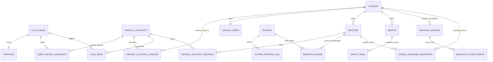

# Fantasy data architecture

This contract defines the durable data boundaries for FANTASY HUD. It governs future provider imports and analytics without creating those future tables prematurely. Migrations remain the SQL source of truth; this document defines grains, relationships, and history rules.

## Core rules

1. Store one provider resource once and associate tracked fantasy accounts with it explicitly.
2. Represent app-user authorization only through `user_fantasy_accounts`; shared provider rows never carry app-user ownership.
3. Keep provider IDs as exact text. Never parse them as JavaScript numbers.
4. Preserve exact source settings separately from derived filter dimensions.
5. Keep mutable current state separate from append-only or completed historical facts.
6. Derive analytics from source facts and associations. Do not persist universal ownership, stack, value, or user-pick flags.
7. Scope every portfolio query through at least one tracked fantasy account.
8. Add tables at a documented grain, not through a generic entity, object, document, or record store.
9. Keep league discovery provider-consistent: `fantasy_accounts.provider`, `leagues.provider`, and `sync_runs.provider` must match.
10. Mutate provider data only through reviewed, narrowly scoped service-only RPCs; service credentials receive no direct provider-table CRUD.

## Layered model



Solid relationships through `SYNC_RUNS` are implemented by Task 005. Relationships below that boundary describe reviewed future grains only; their tables do not exist yet.

## Layer 1 — Identity

Implemented before Task 005:

### `profiles`

Grain: one application profile per `auth.users` row.

This is app presentation state, not provider identity.

### `fantasy_accounts`

Grain: one shared provider identity per `(provider, external_user_id)`.

Usernames and display fields are mutable. The provider user ID is the canonical identity. `last_synced_at` remains reserved for a complete portfolio synchronization, not identity resolution or league discovery.

### `user_fantasy_accounts`

Grain: one app user's tracked association to one shared fantasy account.

This association is the root of portfolio authorization. It does not prove ownership of the external provider identity.

## Layer 2 — Shared provider dimensions

### `provider_season_states` — implemented in Task 005

Grain: the latest fetched state for one `(provider, sport)` pair.

It carries current provider season, league season, creation season, previous season, period fields, season start date, exact provider metadata, and fetch time. It is mutable current state and is not a historical week table.

### `leagues` — implemented in Task 005

Grain: one shared provider league per `(provider, external_league_id)`.

The row contains exact provider settings plus independent derived dimensions:

- `roster_management_type`: `redraft`, `keeper`, `dynasty`, or `unknown`
- `is_best_ball`
- `has_superflex`
- `has_idp`
- `scoring_format`: `ppr`, `half_ppr`, `standard`, `custom`, or `unknown`

A league may be dynasty and best ball simultaneously. Broad scoring never replaces exact `scoring_settings`. One league may have multiple drafts, so no draft foreign key belongs on the league row.

### `fantasy_account_leagues` — implemented in Task 005

Grain: one observation that provider user-league discovery reported one league for one tracked fantasy account.

`first_seen_at`, `last_seen_at`, and `removed_at` describe discovery history. `last_seen_at` cannot precede `first_seen_at`, and `removed_at` is null or at least `last_seen_at`; a removal cannot precede the last positive observation. Removing or marking one association does not delete the shared league. This row does not prove roster ownership.

League-discovery persistence must validate transactionally that the tracked fantasy account, discovered league, and sync run have the same provider. The association does not repeat the provider column.

### Planned dimensions

#### `league_users`

Grain: one provider user identity as represented within one league.

This supports display and commissioner/member context without duplicating global fantasy accounts.

#### `rosters`

Grain: one league-local provider roster.

Future Sleeper roster IDs are league-local integers and must be paired with the league key. Current holdings are mutable state; historical facts are recorded separately.

#### `fantasy_account_rosters`

Grain: one explicit association between a tracked fantasy account and a league roster.

This is the roster-ownership path. It must not be inferred from `fantasy_account_leagues`.

#### `players`

Grain: one canonical football entity.

The entity may represent an offensive player, defensive player, team defense, or another explicitly modeled football entity. Current profile fields can include name, position, physical/bio data, NFL team, injury state, depth-chart state, free-agent state, and provider update timestamps. Team changes and other mutable profile fields update this current row while historical facts retain their original context.

#### `player_external_ids`

Grain: one provider or source external ID for one canonical player.

This mapping must support Sleeper IDs, ESPN IDs, Yahoo IDs, statistics-provider IDs, team-defense identities, free agents, and future source-specific timestamps. Its canonical key includes source plus exact text external ID; a player may have several source mappings.

#### `roster_players`

Grain: one current roster + canonical player membership.

This mutable current-membership table must support `roster_id`, `player_id`, `is_starter`, `is_reserve`, `is_taxi`, source status or roster-position metadata, `first_seen_at`, and `last_seen_at`. Starter, reserve, taxi, and other source-grounded states remain facts even when they do not change an exposure calculation.

Best-ball player exposure counts every current roster membership regardless of starter or bench labels. Drafted exposure comes from immutable `draft_picks`, weekly lineup history comes from `matchup_player_points`, and historical acquisitions, drops, and trades come from transaction facts. A membership-period or roster-snapshot table may be added only when source completeness or measured product requirements prove those facts insufficient.

## Layer 3 — Historical and period facts

These tables are planned, not created by Task 005.

### Drafts and pick ownership

#### `drafts`

Grain: one provider draft in its league or provider context.

A league may have zero, one, or many drafts. Draft status is mutable until the source completes the draft; source completion makes the board immutable except for reviewed correction workflows.

#### `fantasy_account_drafts`

Grain: one explicit association between a tracked fantasy account and a draft context.

This association must not replace complete draft-board storage.

#### `draft_picks`

Grain: one selection at one exact position in one draft.

The table stores the complete provider board, not only user picks. Exact original and current pick ownership must come from source relationships and transaction facts. `is_user_pick`, `is_value`, and similar analytics flags are prohibited.

### Detailed weekly scoreboards

#### `matchup_entries`

Grain: one league + season + week + roster score entry.

Two entries may share one provider matchup ID. A null matchup ID represents a true bye only when the source says so; incomplete or unpaired source data remains explicitly incomplete rather than being rewritten as a bye. The entry supports starters, bench, best-ball and managed formats, total points, custom provider overrides, and historical weekly scoreboards.

#### `matchup_player_points`

Grain: one player score line within one matchup entry.

This preserves per-player weekly fantasy points, starter/bench context, custom point overrides, and the source score line required for leading/trailing portfolio views. Historical points are not overwritten by a player's current profile or team.

### Transactions and pick movement

#### `transactions`

Grain: one league transaction event.

#### `transaction_players`

Grain: one player movement within one transaction.

#### `transaction_draft_picks`

Grain: one draft-pick ownership movement within one transaction.

These append-only facts preserve acquisition, release, waiver, trade, and draft-capital movement without rewriting the original draft board.

### Standings and playoffs

#### `playoff_bracket_entries`

Grain: one provider playoff-bracket entry or pairing at one bracket position.

Current standings may update during a season. Completed weekly results and completed bracket facts remain historical.

#### `league_standing_snapshots`

Grain: one league + season + scoring period or snapshot time + roster.

A source or versioned snapshot may preserve wins, losses, ties, rank, points for, points against, potential points, median or all-play results, waiver position, division, playoff qualification state, source, calculation version, and snapshot timestamp.

Current standings may be computed from roster state and completed matchup facts. Historical standings shown to users must either be reproducibly computed from immutable facts or stored as source/versioned snapshots. Commissioner adjustments and provider-only ranking rules must not be silently lost. League-standing snapshots remain separate from player fantasy rankings, portfolio internal rankings, and market rankings.

### Player statistics and rankings

#### `player_stat_snapshots`

Grain: one player + source + statistical period snapshot.

#### `player_ranking_snapshots`

Grain: one player + ranking source + season + week or snapshot date + scoring context + ranking type.

Every player ranking row requires a source, season, period or snapshot, scoring context, rank or value, and update timestamp. Sleeper search rank is never treated as fantasy rank.

### Market data

#### `market_adp_snapshots`

Grain: one independently verified market source snapshot and its context.

#### `market_adp_values`

Grain: one player or market entity value within one ADP snapshot.

Market ADP stays separate from portfolio-sample ADP. Source licensing, coverage, scoring context, draft type, and snapshot time are part of the domain contract.

## Ranking domains stay separate

FANTASY HUD uses four distinct ranking concepts:

1. League standings rank teams within one league and season.
2. Player fantasy rankings compare players for a source and scoring context.
3. Portfolio internal rankings derive from the user's tracked sample and chosen metric.
4. Market rankings come from an external, independently verified source snapshot.

These domains may be compared analytically but must not share an ambiguous universal `rank` table.

## Layer 4 — Synchronization and observability

### `sync_runs` — implemented in Task 005

Grain: one attempt for one tracked fantasy account and one synchronization scope.

Task 005 permits only `league_discovery`. Status is `running`, `succeeded`, `failed`, or `partial`. Progress and sanitized result/error summaries support operations without storing raw provider responses. Only one running league-discovery attempt may exist per fantasy account.

Task 006 league discovery must lock the fantasy-account/run boundary, reuse a running run whose `updated_at` activity is no more than five minutes old, and recover an older run atomically. Recovery marks the stale run `failed` with terminal time and bounded `stale_run_timeout` metadata before starting a new run. Later multi-resource imports require item leases or explicit heartbeats rather than this single-step timeout rule.

### Deferred synchronization tables

- `sync_run_items`: deferred until multi-resource imports need resumability or per-item retry.
- `provider_resource_cache`: deferred until measured request reuse justifies a cache.
- `scheduled_refreshes`: deferred until a reviewed scheduler and refresh policy exist.

There is no queue, cron, or provider import in Task 005.

## Layer 5 — Analytics

Normalized source rows and explicit associations remain authoritative. Analytics begin as pure application functions or reviewed SQL views. Materialized views appear only after query measurement proves the need and defines refresh semantics.

Every portfolio query is scoped through a tracked fantasy account. The intended paths include:

| Analysis                        | Source path                                                                          |
| ------------------------------- | ------------------------------------------------------------------------------------ |
| Player exposure                 | tracked account → owned roster association → roster holdings → canonical player      |
| NFL-team breadth                | player exposure → player current or period-specific NFL-team context                 |
| Roster-slot share               | roster holdings → exact source roster slot → normalized presentation category        |
| Position allocation             | canonical player position plus explicit roster and league context                    |
| Draft capital                   | complete draft board + exact draft position + ownership movement facts               |
| Stacks                          | co-holdings joined to explicit player/NFL-team relationships for the selected period |
| Co-holdings                     | pairs or sets derived from simultaneous roster holdings, never a persisted boolean   |
| Scoring and league-size filters | exact league settings plus independent derived dimensions                            |
| Multi-season comparison         | season-keyed leagues, rosters, drafts, matchups, and snapshots                       |
| Weekly portfolio performance    | matchup entries + player score lines scoped through owned rosters                    |
| Current and historical rankings | source-specific ranking snapshots joined by canonical player identity                |
| Portfolio-sample ADP            | complete tracked draft boards, explicitly labeled as the user's sample               |
| External market ADP             | independent market snapshots and values with their own source contract               |

## History contract

| Entity category                              | History rule                                                                                                                 |
| -------------------------------------------- | ---------------------------------------------------------------------------------------------------------------------------- |
| Profile and fantasy-account presentation     | Mutable current state; canonical IDs and creation time remain stable.                                                        |
| Provider season state                        | Mutable latest state, replaced per provider and sport; not historical facts.                                                 |
| League current configuration/status          | Mutable current state while exact provider configuration remains preserved on the current row.                               |
| Account-to-league discovery                  | Mutable observation window; `first_seen_at` is stable, later sightings update `last_seen_at`, and absence sets `removed_at`. |
| Roster current holdings                      | Mutable current state in a future roster-holding model.                                                                      |
| Player current profile                       | Mutable current state; provider/source timestamps identify freshness.                                                        |
| Player external identity mapping             | Stable mapping unless a source correction is explicitly audited.                                                             |
| Draft metadata before completion             | Mutable source state.                                                                                                        |
| Completed draft board and picks              | Immutable after source completion except reviewed correction.                                                                |
| Matchup entries and per-player weekly points | Append-only historical facts per league, season, and week after source finalization.                                         |
| Transactions and their player/pick movements | Append-only historical facts.                                                                                                |
| Completed playoff bracket entries            | Immutable after source completion.                                                                                           |
| League standing snapshots                    | Append-only source/versioned snapshots when immutable facts cannot reproduce the standing.                                   |
| Player stat snapshots                        | Append-only source snapshots.                                                                                                |
| Player ranking snapshots                     | Append-only source-and-context snapshots.                                                                                    |
| Market ADP snapshots and values              | Immutable source snapshots.                                                                                                  |
| Sync runs                                    | Append-only attempts whose running row may progress to one terminal state; completed attempts are retained.                  |
| Derived analytics                            | Recomputable functions or views; stored materialization requires measured need and explicit refresh rules.                   |

Source errors are never translated into empty collections. Unknown, unavailable, not yet fetched, and confirmed empty remain distinct states. Immutable historical facts are not overwritten by current player, roster, league, or team state.

## Historical player-context rule

Immutable and period facts preserve the player context used when the fact occurred. Depending on the grain, that includes position at draft, NFL team at draft, NFL team during the scoring week, the source player ID used for the fact, and the scoring context used for a rank or score. A future implementation may use fact-level snapshot columns or reviewed effective-dated player/team relationships.

This rule applies explicitly to `draft_picks`, `matchup_player_points`, `transactions` and their player movements, `player_stat_snapshots`, and `player_ranking_snapshots`. Historical analytics never silently join only to a player's present-day team or position.

## Authorization contract

The browser read path is:

```text
auth.uid()
→ user_fantasy_accounts.user_id
→ fantasy_accounts.id
→ fantasy_account_leagues.fantasy_account_id
→ leagues.id
```

Future roster, draft, matchup, and analytic reads extend this path through explicit associations. Browser roles never write provider data. Direct `service_role` CRUD on provider-data tables is revoked. Validated server-side operations may write later imports only through reviewed `SECURITY DEFINER` RPCs after app-user claims, tracked-account reachability, and provider consistency are validated; `service_role` receives only `EXECUTE` on those functions.

## Task 005 boundary

Task 005 creates only:

- `provider_season_states`
- `leagues`
- `fantasy_account_leagues`
- `sync_runs`

It makes no Sleeper request, discovers no league, starts no synchronization, and creates none of the planned child, fact, ranking, cache, queue, scheduler, or analytics tables described above.

Task 005.1 adds one corrective constraint replacement and revokes direct provider-table privileges from `service_role`. It creates no table, function, provider request, provider import, or product behavior.

## Task 006 boundary

Task 006 is the first provider-data import. It resolves the active league season from provider state, validates the entire current-season Sleeper league collection twice (application and SQL), and atomically upserts provider state, canonical shared leagues, account discovery associations, scoped removals, and one terminal sync run. Current-season reads resolve provider state first and then scope active associations and succeeded runs to the exact resolved season; historical associations remain stored but are not current-season rows.

League fetch time is recorded in required `leagues.fetched_at`. Shared provider-state and league current representations are monotonic by fetch time: an older observation cannot overwrite a newer row, although its importing account may still gain an association. The nullable `provider_updated_at` column is reserved for a reliable provider-published update time, is not populated from request time, and is preserved when a later accepted observation contains null. Exact settings, scoring settings, roster positions, and unmodeled metadata remain available beside conservative classifications.

Concurrent first discovery of a shared league uses conflict-safe canonical insert-or-load. Collections are persisted in ascending external league ID order so transactions acquire shared-resource locks deterministically and every account resolves the same internal league IDs.

A confirmed empty collection is successful. Any source, shape, duplicate, season, or completion error preserves the last successful data. Reconciliation never crosses the exact account, provider, sport, and season scope, never deletes a shared league, never infers roster ownership, and never updates `fantasy_accounts.last_synced_at`.

No roster, player, draft, pick, matchup, transaction, rank, market, cache, queue, or analytics table is added by Task 006.

Live source-shape and classification verification remains a controlled post-merge canary; fixtures and documentation do not substitute for a retained live response.

## Task 007A boundary

Task 007A creates `players`, `player_external_ids`, and `provider_catalog_runs` plus private bounded staging. It imports the complete shared Sleeper NFL player resource through one global 24-hour freshness boundary. Canonical player identity follows the exact Sleeper map key. Current profiles advance only by `profile_fetched_at`; source `news_updated_at` remains a distinct optional field, and search rank remains non-fantasy search metadata.

Team defenses are canonical entities. Sparse valid IDs remain explicit unknown entities. Optional display fields reject ASCII control characters in the original value before outer whitespace normalization. Primary mappings preserve removal and reactivation history, so a retained canonical row may outlive its active Sleeper mapping. Documented secondary IDs are conservative candidates only: ambiguity and cross-player conflicts are skipped, and no secondary identifier can merge canonical players automatically.

The full map is normalized before private deterministic batches are staged. Initial and relative count guards prevent destructive truncation. Final publication, mapping reconciliation, terminal result counts, and staging cleanup are atomic. Canonical-entity totals retain all player rows; active-player totals require an active individual-player profile and active primary Sleeper/NFL mapping; team-defense totals require an active primary mapping but not the provider's optional active flag. Unknown entities remain separate. Browser roles read player data under RLS and global catalog status only through safe column grants; catalog-run `triggered_by_user_id` remains server-only audit state. `service_role` has execute-only lifecycle access and no direct catalog-table CRUD.

Task 007A creates no roster, account-to-roster ownership, roster-player membership, draft, matchup, transaction, statistic, fantasy ranking, market, cache, queue, scheduler, or analytics data. It never updates `fantasy_accounts.last_synced_at`. Task 007B remains the future account-to-roster ownership boundary.
