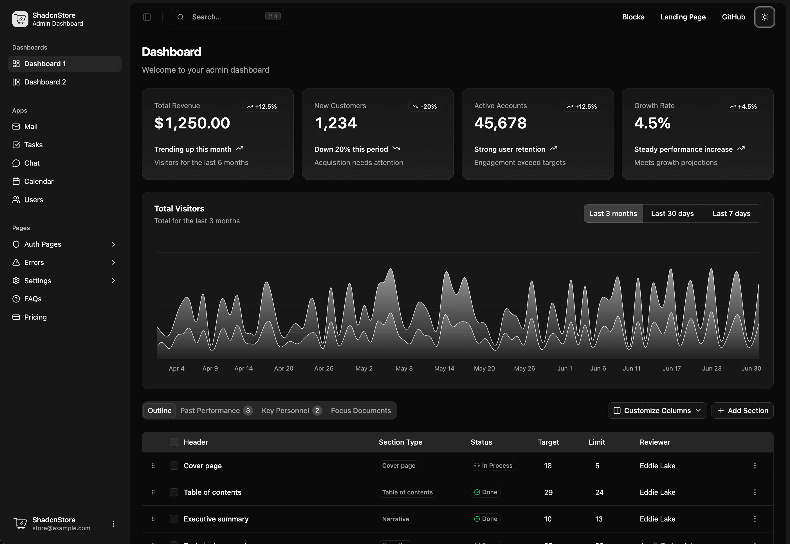
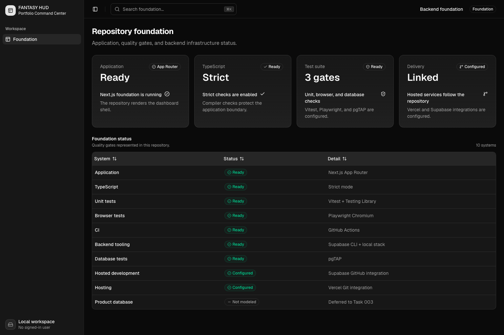
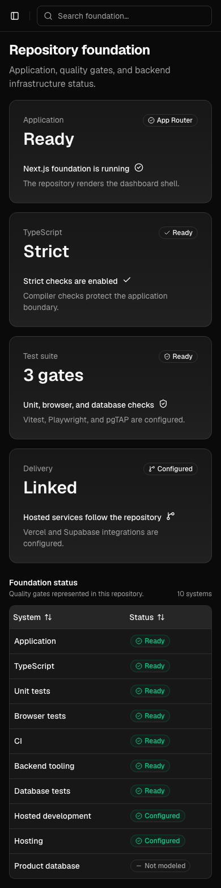

# Task 002.1 visual comparison

## Canonical ShadcnStore reference

The reference image is copied from `nextjs-version/public/dashboard-dark.png` in the supplied MIT-licensed ShadcnStore archive. Attribution and license preservation are recorded in `REFERENCE_STYLE.md` and `THIRD_PARTY_LICENSES/ShadcnStore-MIT.txt`.

## FANTASY HUD desktop — 1536 × 1024

## FANTASY HUD mobile — 390 × 844

Both FANTASY HUD captures were produced through Playwright after `document.fonts.ready`, with dark mode enforced, search cleared, and animations, transitions, and the caret disabled.

## Deliberate differences

- Geist Sans and Geist Mono replace the reference's Inter typography while retaining its sizes, weights, and hierarchy.
- FANTASY HUD branding and repository-foundation facts replace ShadcnStore branding and demo analytics.
- One real Workspace → Foundation route leaves the sidebar intentionally sparse.
- The real inline header search replaces the demo command palette; two repository-state labels replace marketing links and the theme toggle.
- The foundation table follows the cards because charts and fake analytics are outside scope.
- Card footer copy wraps according to truthful foundation content rather than being shortened into invented metrics.
- Mobile keeps the canonical horizontally scrollable table so columns are not collapsed or removed.

## Excluded reference features

- Charts, demo datasets, tabs, pagination, drag-and-drop, row selection, inline editing, actions menus, column customization, and Add Section
- Theme, layout, and sidebar customizers; theme toggle; upgrade promotion
- Fake app navigation, authentication/settings routes, external marketing links, and promotional notifications
- Fake user avatar, email, account menu, and site footer

No other major visual difference is intentional. Shell dimensions, page insets, neutral tokens, radius, header structure, sidebar proportions, card composition, table density, and responsive breakpoints track the extracted Next.js reference.
